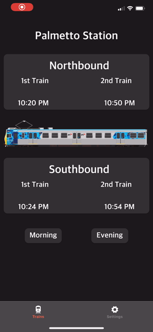
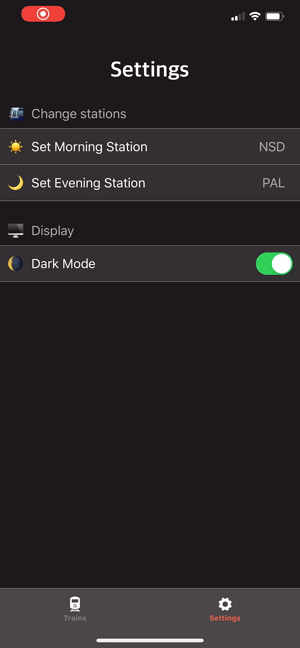

# Metrorail App

<br/>

## 📖 Table of Contents
- [About](#about)
- [Demos](#demos)
- [Setup](#setup)
- [Author](#author)

## ✍🏻 About <a name="about"></a>

### Why Make This?

Ever since I began taking the Miami Dade Metrorail this year I immediately became frustrated by their app. 
It's very bloated and the information that I need is not presented in an easy to understand manner, as well as cumbersome to access.
Therefore I set out to make an app focused soley on the Metrorail that delivered the info I needed in a simple and easy to use manner.

### Process

1. Create a React Native application centered around a bottomTabNavigator for navigation.
2. Use Axios to make API calls to the official Miami Dade Metro API.
3. Store the data in a global state using React-Redux.
4. Save user settings and preferences using React-Persist so the data stays intact, even after the app has been forced closed.
5. Use iOS design cues to style the application.

#### For more details on the code and logic used, please refer to the comments and documentation inside of the code.*

## 📱 Demos <a name="demos"/>

### Toggle Morning and Evening Stations
<br/>
- On the main page one can quickly and easily toggle between their set morning and evening stations
- Here they have can see when the next two incoming trains are due
### Changing Stations
<br/>
- In the Settings tab users can set what their morning and evening stations are
- This is saved globally so they can now see the info in the Trains tab
### Dark Mode
<br/>
- Users can set what their display preference is
- This change is reflected across the entire app
### Persistent Settings
<br/>
- User settings are saved locally using React Persist and Asynchronous Storage
- These settings persist wwhen the app is closed or force closed from multitasking

## 🛠 Setup <a name="setup"/>

### Installation

*   Clone the [repo]('https://github.com/alegomez1/MetroTimes-React-Native/')
*   Use ```npm install``` or ```yarn install``` to install the necessary dependencies
*   Install the latest version of Xcode as well as the React Native CLI
*   Run ```react-native run-ios```
*   iPhone simulator will launch for testing
#### Deploy on Personal iPhone
*   Open the Metro.xcodeproj from the iOS folder in Xcode
*   Select your device
*   Run the build


## 📦 Created using:
* [React Native](https://facebook.github.io/react-native/) - Application Design Language
* [Xcode](https://developer.apple.com/xcode/) - Simulator and Deploying to device
* [Javascript](https://www.javascript.com/) - Frontend and backend
* [React Redux](https://redux.js.org/basics/usage-with-react) - Global state manager
* [Redux Persist](https://github.com/rt2zz/redux-persist) - Allows for persistance of data

## 🙋🏼‍♂️ Created by: <a name="author"></a>
* [Alejandro Gomez](https://github.com/alegomez1)
